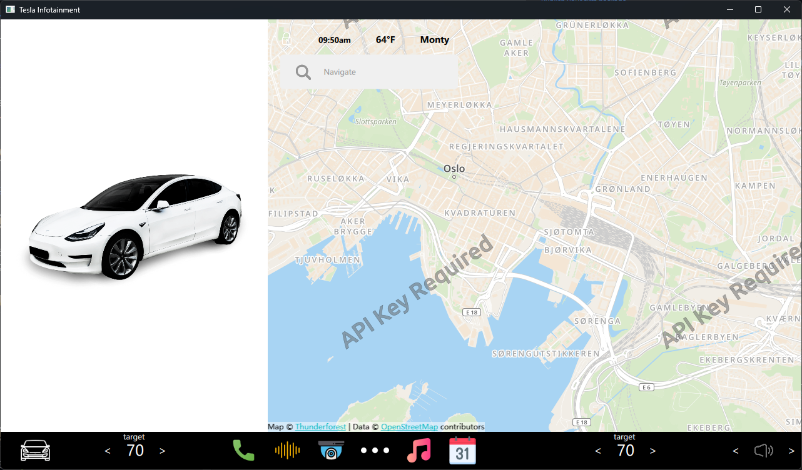

# Qt6_TeslaUI

[中文版](README.md)

## Project Overview

Qt6_TeslaUI is a user interface project built using Qt 6, designed to simulate the interface of Tesla vehicles. This project demonstrates the powerful capabilities of the Qt framework to create modern and responsive user interfaces.

## Result

## Project Structure

Qt6_TeslaUI/ 

├── ui/ # Source code directory 

├── Controllers/ # c++ files directory 

├── ui/assets/ # Assets (e.g., images, icons) 

├── CMakeLists.txt # CMake build file 

└── README.md # Project description file

## Development Environment

- **Qt Version**: 6.x
- **Programming Language**: C++
- **Operating Systems**: Cross-platform (Windows, macOS, Linux)