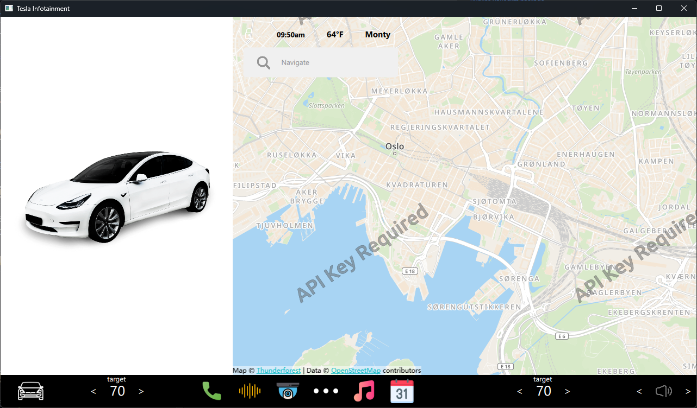

# Qt6_TeslaUI

[English Version](README-en.md)

## 项目简介
Qt6_TeslaUI 是一个使用 Qt 6 构建的用户界面项目，旨在模拟特斯拉车辆的界面。该项目展示了如何利用 Qt 框架的强大功能来创建现代化、响应式的用户界面。

## 效果图

## 项目结构

Qt6_TeslaUI/ 

├── ui/ # 源代码目录 

├── Controllers/ # C++文件目录 

├──  ui/assets/ # 资源文件（如图片、图标等） ├── CMakeLists.txt # CMake 构建文件 

└── README.md # 项目简介文件

## 开发环境 

- **Qt 版本**: 6.x 

- **编程语言**: C++ 

-  **操作系统**: 跨平台（Windows、macOS、Linux） 

  